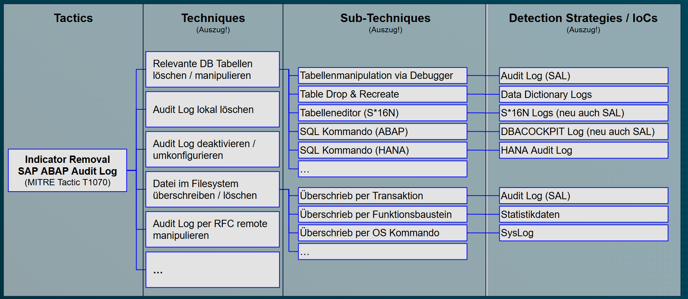
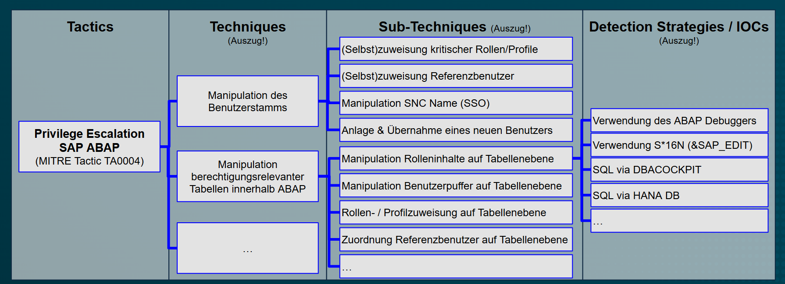

## Motivation zur Erstellung
Das hiermit erstellte Use Case Repository ist als Teil der DSAG Themengruppe (TG) "SIEM" innerhalb des Arbeitskreises "Security & Vulnerability Management" entstanden. Über den DSAG SAP SIEM Survey 2026 und darauf aufbauende Diskussionen ließ sich feststellen, dass die Auswahl geeigneter Use Cases, die Reduktion von False Positives ("Alert Fatigue") sowie die Integration der Incident Response in den Security Operations Center (SOC) wesentliche Herausforderungen darstellen.
Dieses Dokument hat zum Ziel die aus Sicht der TG wichtigsten SIEM Use Cases in SAP, die unabhängig von individuellem Risikoscoping aus Sicht der TG sinnvoll sind, auf Basis der notwendigen Daten- und Logquellen zu definieren. Dies soll unabhängig von verschiedenen SAP SIEM Toolanbietern am Markt geschehen. Zusätzlich sollen durch die Anwendung etablierter Konzepte im SIEM Umfeld (insbesondere MITRE ATT&CK und Open Cyber Security Schema Framework (OCSF)) Grundlagen geschaffen werden, dass ein SOC auch ohne dediziertes SAP Security Know-How Teile der Incident Response übernehmen können und auch eine Korrelation mit SAP-fremden Datenquellen erfolgen kann.  

## Vorgehen zur Definition eines Use Cases
Die Definition eines Use Cases soll sich an das vom MITRE Konsortium entwickelte Vorgehen zum [Threat Modeling](https://github.com/center-for-threat-informed-defense/threat-modeling-with-attack) auf Basis von [MITRE ATT&CK](https://attack.mitre.org/) unter Verwendung von Angriffsbäumen ("attack trees") anlehnen. Ein Angriffsbaum ist eine Methode zur Bedrohungsanalyse, über die verschiedene Wege abgebildet werden können, auf denen ein Angreifer das System angreifen kann (Techniques), um ein Ziel zu erreichen (Tactic / Angriffsvektor).
Beispielhaft 

Das bedeutet, eine Tactic nach MITRE stellt begrifflich einen "Use Case" dar, während die Erkennungsmuster über Techniques und Sub-Techniques abgebildet werden können. Im letzten Schritt lässt sich dann ermitteln, wie diese Erkennungsmuster konkret innerhalb der relevanten SAP Anwendungen ermittelt werden können (welche Logquellen werden benötigt, wie ist zu selektieren etc).    

- ausgehend vom Angriffsvektor / Risiko
- mapping auf MITRE (Verständnis außerhalb SAP Welt; SOC Integration)

## Aufbau und Struktur des Repositories

### Log Source Definition und OCSF Mapping
...

### Use Case Definition
...

### Relevante Spezifika
(z.B. Betriebsmodell; abhängige Logkonfiguration; Releaseabhängigkeit...)

### Übliche False Positives und Skizzierung Incident Response
...